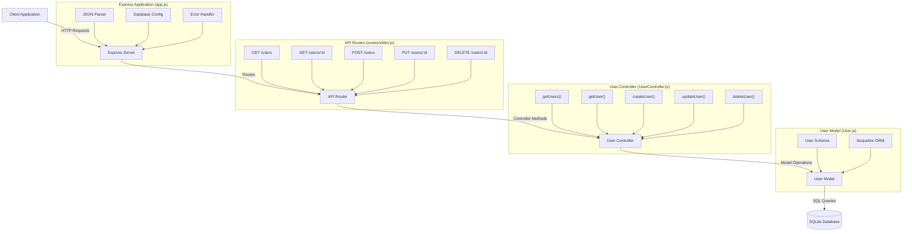
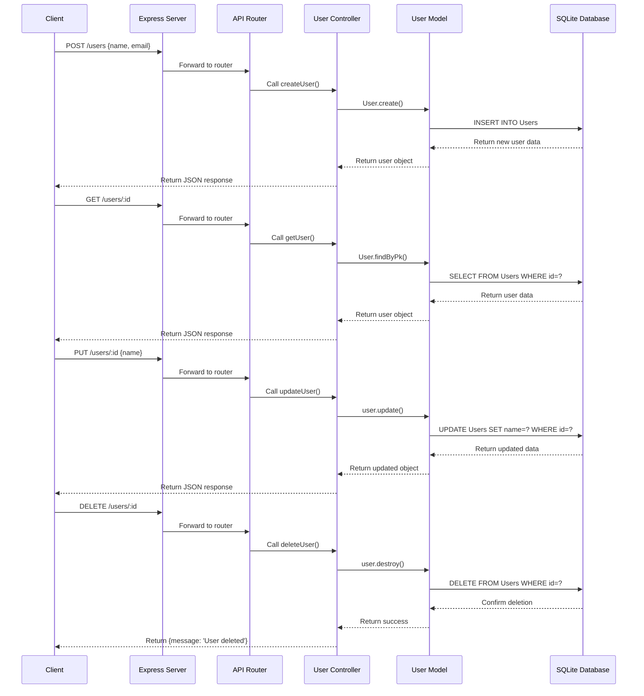
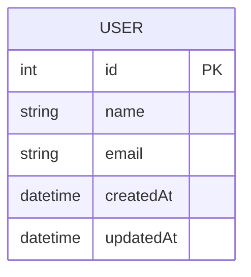
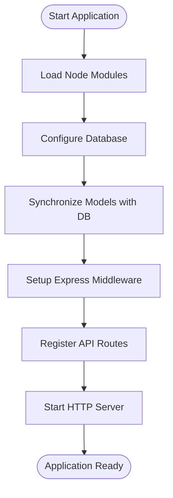

# System Architecture and Flow Diagram

## Overall System Architecture

```mermaid
graph TD
    %% Main Components
    Client[Client Application] --> |HTTP Requests| Express[Express Server]
    Express --> |Routes| Router[API Router]
    Router --> |Controller Methods| Controller[User Controller]
    Controller --> |Model Operations| Model[User Model]
    Model --> |SQL Queries| DB[(SQLite Database)]
    
    %% Express Server Details
    subgraph "Express Application (app.js)"
        Express
        Middleware1[JSON Parser] --> Express
        Config[Database Config] --> Express
        ErrorHandler[Error Handler] --> Express
    end
    
    %% Router Details
    subgraph "API Routes (routes/index.js)"
        Router
        GetAllUsers[GET /users] --> Router
        GetUser[GET /users/:id] --> Router
        CreateUser[POST /users] --> Router
        UpdateUser[PUT /users/:id] --> Router
        DeleteUser[DELETE /users/:id] --> Router
    end
    
    %% Controller Details
    subgraph "User Controller (UserController.js)"
        Controller
        GetUsersMethod["getUsers()"] --> Controller
        GetUserMethod["getUser()"] --> Controller
        CreateUserMethod["createUser()"] --> Controller
        UpdateUserMethod["updateUser()"] --> Controller
        DeleteUserMethod["deleteUser()"] --> Controller
    end
    
    %% Model Details
    subgraph "User Model (User.js)"
        Model
        UserSchema[User Schema] --> Model
        SequelizeORM[Sequelize ORM] --> Model
    end
```

## Request/Response Flow

```mermaid
sequenceDiagram
    participant Client
    participant Express as Express Server
    participant Router as API Router
    participant Controller as User Controller
    participant Model as User Model
    participant DB as SQLite Database
    
    %% Create User Flow
    Client->>Express: POST /users {name, email}
    Express->>Router: Forward to router
    Router->>Controller: Call createUser()
    Controller->>Model: User.create()
    Model->>DB: INSERT INTO Users
    DB-->>Model: Return new user data
    Model-->>Controller: Return user object
    Controller-->>Client: Return JSON response
    
    %% Get User Flow
    Client->>Express: GET /users/:id
    Express->>Router: Forward to router
    Router->>Controller: Call getUser()
    Controller->>Model: User.findByPk()
    Model->>DB: SELECT FROM Users WHERE id=?
    DB-->>Model: Return user data
    Model-->>Controller: Return user object
    Controller-->>Client: Return JSON response
    
    %% Update User Flow
    Client->>Express: PUT /users/:id {name}
    Express->>Router: Forward to router
    Router->>Controller: Call updateUser()
    Controller->>Model: user.update()
    Model->>DB: UPDATE Users SET name=? WHERE id=?
    DB-->>Model: Return updated data
    Model-->>Controller: Return updated object
    Controller-->>Client: Return JSON response
    
    %% Delete User Flow
    Client->>Express: DELETE /users/:id
    Express->>Router: Forward to router
    Router->>Controller: Call deleteUser()
    Controller->>Model: user.destroy()
    Model->>DB: DELETE FROM Users WHERE id=?
    DB-->>Model: Confirm deletion
    Model-->>Controller: Return success
    Controller-->>Client: Return {message: 'User deleted'}
```

## Data Model

```mermaid
erDiagram
    USER {
        int id PK
        string name
        string email
        datetime createdAt
        datetime updatedAt
    }
```

## Application Startup Flow

```mermaid
flowchart TD
    Start([Start Application]) --> LoadModules[Load Node Modules]
    LoadModules --> ConfigDB[Configure Database]
    ConfigDB --> SyncModels[Synchronize Models with DB]
    SyncModels --> SetupMiddleware[Setup Express Middleware]
    SetupMiddleware --> RegisterRoutes[Register API Routes]
    RegisterRoutes --> StartServer[Start HTTP Server]
    StartServer --> Ready([Application Ready])
```
